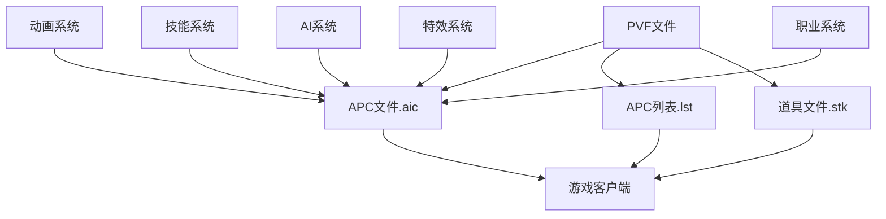

# DNF APC文件依赖关系

## 📊 依赖关系图



## 🔄 文件关联机制

### 1. APC文件(.aic) 与 APC列表(.lst)
- **关联类型**: 强依赖
- **作用机制**: 
  - `aicharacter.lst`定义了APC ID与实际.aic文件的关联
  - APC文件(.aic)负责APC的实际参数和功能实现
  - APC列表引用APC文件路径，建立索引关系

### 2. 道具文件(.stk) 与 APC召唤
- **关联类型**: 功能依赖
- **作用机制**:
  - 道具文件定义了召唤APC的功能
  - 通过`summon apc`参数关联特定APC
  - 修改道具文件可以改变召唤的APC类型

### 3. 动画文件(.ani) 与 APC显示
- **关联类型**: 显示依赖
- **作用机制**:
  - .ani文件提供APC的动画效果
  - 在.aic文件中声明引用
  - 控制APC的动作和外观

### 4. 技能系统 与 APC技能
- **关联类型**: 功能增强
- **作用机制**:
  - APC可能使用特定技能
  - 技能ID与技能系统关联
  - 通过内部参数实现战斗行为

### 5. 职业系统 与 APC适配
- **关联类型**: 适配依赖
- **作用机制**:
  - 职业系统定义职业特性
  - APC文件根据职业特性调整功能
  - 通过职业参数控制职业技能

## 🔗 依赖关系详解

### 核心依赖路径
```
aicharacter.lst(列表关联) 
    ↓
APC文件(.aic) 
    ↓
动画/特效文件
    ↓
游戏客户端显示
```

### 召喚機制
```
道具文件(.stk)
    ↓
[summon apc]參數
    ↓
APC編號關聯
    ↓
特定APC(.aic)
```

### 调用机制
1. **客户端请求**: 游戏客户端通过道具召唤APC
2. **道具解析**: 解析道具文件中的summon apc参数
3. **APC加载**: 根据编号加载对应.aic文件
4. **动画播放**: 加载相关动画和特效文件
5. **功能执行**: 读取APC参数实现AI和战斗功能

### 影响链路
- 修改.aic文件 → APC属性改变 → 战斗体验变化
- 修改.aicharacter.lst → APC关联改变 → 游戏内容变化
- 修改道具文件 → 召喚APC類型改變 → 遊戲內容變化
- 修改動畫文件 → APC外觀改變 → 玩家界面變化

## 📁 目录结构依赖

### APC文件依赖
```
aicharacter.lst
    ↓
/aicharacter/目錄下APC文件
    ↓
[分類]/[編號]/[編號].aic
    ↓
相關動畫和資源文件
```

### 召喚道具依賴
```
召喚道具文件(.stk)
    ↓
[summon apc]參數
    ↓
指定APC編號
    ↓
對應APC配置
```

### 資源關聯
- `/aicharacter/` - APC基礎參數文件目錄
- `*.ani` - 動畫配置文件
- `*.act` - 行為配置文件
- `/animation/` - 動畫資源目錄
- `/particle/` - 特效資源目錄

## ⚠️ 依赖注意事项

1. **強依賴**: aicharacter.lst修改錯誤會導致遊戲無法識別APC
2. **同步修改**: 修改APC文件時，確保列表和資源也同步更新
3. **兼容性檢查**: 確保修改不破壞現有依賴關係
4. **備份策略**: 修改前備份原文件，確保可回滾

## 🔍 關鍵依賴文件

### APC相關
- `aicharacter.lst` - APC列表與APC文件的關聯
- `/aicharacter/` - APC參數文件目錄
- `aicharacter.kor.str` - APC名稱顯示文件

### 召喚道具關聯
- `/stackable/professional/puppet/` - 召喚道具文件目錄
- 召喚技能相關道具文件

### 技能關聯
- `skill.lst` - 技能列表（當APC使用技能時）
- `/skill/` - 技能參數文件（當APC使用技能時）

### 資源關聯
- `*.ani` - 動畫資源文件
- `*.act` - 行為配置文件
- `*.obj` - 對象配置文件
- `/action/` - 動作目錄

### AI系統關聯
- AI參數配置文件
- 行為邏輯配置文件
- 路徑尋找配置文件

---
*本依賴關係文件旨在幫助理解DNF APC系統中各文件的相互關係*