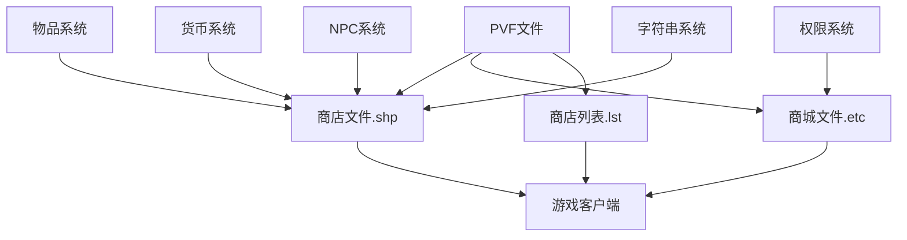

# DNF NPC商店文件依赖关系

## 📊 依赖关系图



## 🔄 文件关联机制

### 1. 商店文件(.shp) 与 NPC系统
- **关联类型**: 强依赖
- **作用机制**: 
  - 商店文件(.shp)定义了NPC商店中的商品列表
  - NPC系统调用商店文件显示可购买商品
  - 通过NPC编号关联特定商店文件

### 2. 商城文件(.etc) 与 商城系统
- **关联类型**: 核心依赖
- **作用机制**:
  - `newcashshop.etc`存储商城商品详细信息
  - 商城系统读取该文件展示商品
  - 包含价格、限制等详细配置

### 3. 物品系统 与 商店商品
- **关联类型**: 数据依赖
- **作用机制**:
  - 商店引用物品系统中的物品代码
  - 物品代码对应具体物品参数
  - 修改物品代码影响商店销售内容

### 4. 货币系统 与 价格设置
- **关联类型**: 交易依赖
- **作用机制**:
  - 商店商品设置所需货币类型和数量
  - 货币系统验证玩家余额
  - 控制购买交易流程

### 5. 字符串系统 与 显示信息
- **关联类型**: 显示依赖
- **作用机制**:
  - 字符串文件提供物品名称显示
  - 与商品代码关联
  - 修改影响界面显示内容

## 🔗 依赖关系详解

### 核心依赖路径
```
商店.shp文件(商品列表) 
    ↓
物品系统(商品参数) 
    ↓
货币系统(价格验证) 
    ↓
游戏客户端显示
```

### 商城系统依赖路径
```
newcashshop.etc(商品配置) 
    ↓
权限系统(购买限制) 
    ↓
货币系统(支付处理) 
    ↓
商城界面显示
```

### 调用机制
1. **客户端请求**: 玩家打开NPC商店
2. **文件解析**: 读取对应的.shp或.etc文件
3. **数据加载**: 加载商品详细参数
4. **界面显示**: 显示可购买商品列表
5. **交易处理**: 处理购买和支付流程

### 影响链路
- 修改.shp文件 → 商店商品改变 → 玩家购买选择变化
- 修改.etc文件 → 商城商品改变 → 玩家商城体验变化
- 修改货币设置 → 价格调整 → 玩家消费行为变化
- 修改限制参数 → 购买限制改变 → 玩家购买权限变化

## 📁 目录结构依赖

### 商店文件依赖
```
itemshop-equipmentshop3.shp (赛利亚商店)
    ↓
物品代码引用
    ↓
对应物品参数文件
    ↓
.kor.str名称文件
```

### 商城系统依赖
```
etc/newcashshop.etc
    ↓
etc/newcashshop_restrict.etc
    ↓
商城物品代码
    ↓
物品参数文件
```

### NPC关联依赖
```
NPC配置文件
    ↓
商店文件关联
    ↓
商品列表
    ↓
购买权限验证
```

## ⚠️ 依赖注意事项

1. **强依赖**: 商店文件修改错误会导致游戏无法显示商品
2. **同步修改**: 修改商品代码时，确保物品系统中存在对应物品
3. **兼容性检查**: 确保修改不破坏现有依赖关系
4. **备份策略**: 修改前备份原文件，确保可回滚

## 🔍 关键依赖文件

### 商店相关
- `itemshop-*.shp` - NPC商店配置文件
- `itemshop.lst` - 商店列表文件
- `*.kor.str` - 商品名称显示文件

### 商城相关
- `etc/newcashshop.etc` - 商城主配置文件
- `etc/newcashshop_restrict.etc` - 商城限制配置文件
- `etc/cashitem.etc` - 现金物品配置文件

### 物品系统关联
- `/stackable/` - 消耗品参数目录
- `/equipment/` - 装备参数目录
- 物品代码对应的所有参数文件

### 货币系统关联
- 货币类型定义文件
- 价格配置文件
- 交易处理相关文件

### 权限系统关联
- 账号购买限制文件
- 赠送权限配置文件
- 购买历史记录文件

---
*本依赖关系文件旨在帮助理解DNF NPC商店系统中各文件的相互关系*