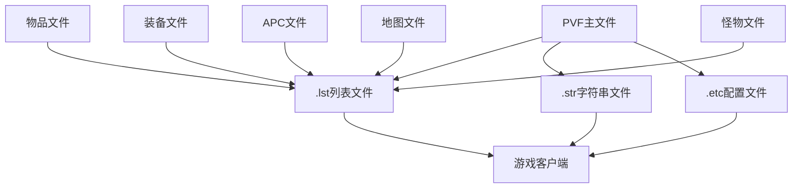

# DNF PVF文件依赖关系

## 📊 依赖关系图



## 🔄 文件关联机制

### 1. .lst 文件与实际资源
- **关联类型**: 核心依赖
- **作用机制**:
  - .lst文件将代码ID与实际资源路径关联
  - 游戏通过.lst文件找到对应的资源
  - 修改错误会导致服务端无法启动

### 2. .str 文件与显示文本
- **关联类型**: 显示依赖
- **作用机制**:
  - .str文件提供游戏中的文本显示内容
  - 与.lst文件中的项目关联
  - 修改不影响服务端运行但影响显示

### 3. .etc 文件与配置
- **关联类型**: 配置依赖
- **作用机制**:
  - .etc文件存储详细参数配置
  - 与游戏逻辑和实体关联
  - 控制具体的游戏功能行为

## 🔗 依赖关系详解

### 核心依赖路径
```
.lst文件(关联表) 
    ↓
资源文件(.equ/.stk/.aic等) 
    ↓
.str文件(文本显示) 
    ↓
游戏客户端显示
```

### 调用机制
1. **客户端请求**: 游戏客户端通过ID请求资源
2. **列表解析**: 解析.lst文件找到资源路径
3. **资源加载**: 加载对应资源文件
4. **文本显示**: 从.str文件获取显示文本
5. **效果执行**: 从.etc文件获取执行参数

### 影响链路
- 修改.lst文件 → 资源关联改变 → 游戏内容变化
- 修改.str文件 → 显示文本改变 → 玩家界面变化
- 修改.etc文件 → 参数配置改变 → 游戏行为变化

## 📁 目录依赖结构

### 装备系统依赖
```
equipment.lst
    ↓
/equipment/目录下各个装备文件
    ↓
.kor.str文件中的装备名称
```

### 物品系统依赖
```
stackable.lst
    ↓
/stackable/目录下各个物品文件
    ↓
.kor.str文件中的物品名称
```

### APC系统依赖
```
aicharacter.lst
    ↓
/aicharacter/目录下各个APC文件夹
    ↓
APC的.aic配置文件
    ↓
.kor.str文件中的APC文本
```

## ⚠️ 依赖注意事项

1. **强依赖**: .lst文件修改错误会导致服务端启动失败
2. **关联修改**: 修改资源文件时，必须确保.lst文件中已正确关联
3. **格式要求**: .lst文件末尾格式要求严格
4. **文件存在**: 所有关联的文件路径必须真实存在

## 🔍 关键依赖文件

### 装备相关
- `equipment.lst` - 装备列表与装备文件的关联
- `/equipment/` - 装备参数文件目录
- `*.kor.str` - 装备名称显示文件

### 物品相关
- `stackable.lst` - 物品列表与物品文件的关联
- `/stackable/` - 物品参数文件目录
- `*.kor.str` - 物品名称显示文件

### APC相关
- `aicharacter.lst` - APC列表与APC文件的关联
- `/aicharacter/` - APC配置文件目录
- `aicharacter.kor.str` - APC名称显示文件

### 怪物相关
- `monster.lst` - 怪物列表与怪物文件的关联
- `/monster/` - 怪物参数文件目录
- `*.kor.str` - 怪物名称显示文件

---
*本依赖关系文件旨在帮助理解DNF PVF系统中各文件的相互关系*