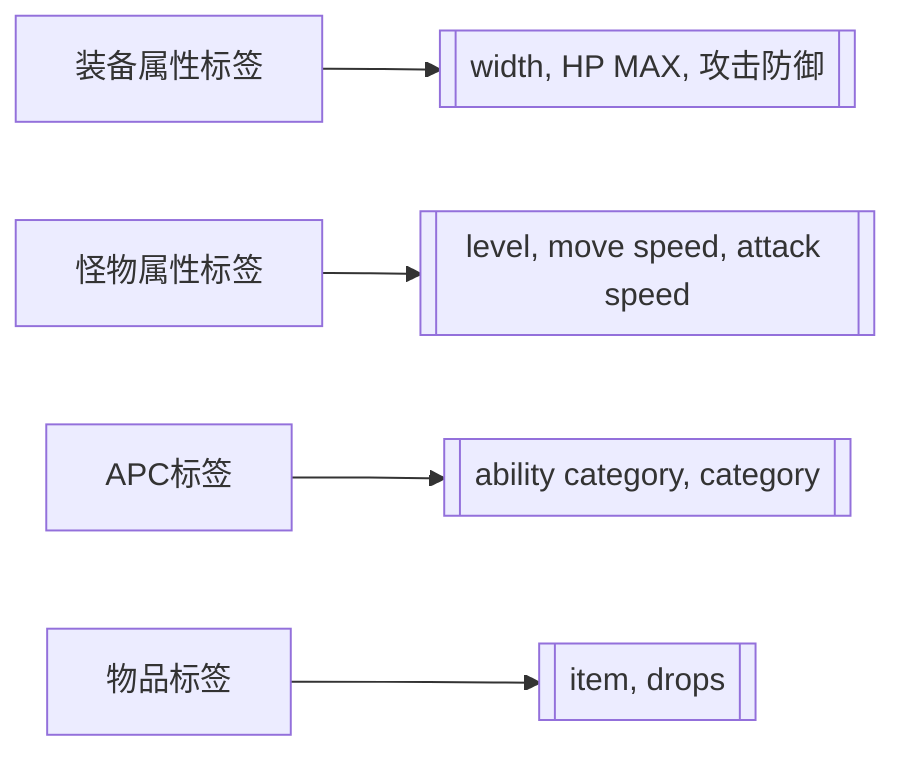

# DNF PVF文件核心标签参考

## 🏷️ 装备属性标签

### 基础属性标签
- **[width]** 
  - 功能作用: 定义物品在背包中的显示宽度
  - 参数详解: 
    - 类型: 数值型
    - 作用: 控制背包格子占用
    - 取值范围: 通常为1-10
    - 默认值: 根据物品类型确定
  - 实际应用: 控制背包界面布局
  - 依赖关系: 与背包界面系统关联

- **[HP MAX]**
  - 功能作用: 最大生命值加成
  - 参数详解:
    - 类型: 数值型
    - 作用: 增加角色最大生命值
    - 取值范围: 根据装备等级确定
    - 默认值: 0
  - 实际应用: 提升角色生存能力
  - 依赖关系: 与角色生命值系统关联

- **[EQUIPMENT_PHYSICAL_ATTACK]**
  - 功能作用: 物理攻击力加成
  - 参数详解:
    - 类型: 数值型
    - 作用: 增加角色物理攻击力
    - 取值范围: 根据装备等级确定
    - 默认值: 0
  - 实际应用: 提升物理职业伤害
  - 依赖关系: 与物理伤害计算系统关联

- **[EQUIPMENT_PHYSICAL_DEFENSE]**
  - 功能作用: 物理防御力加成
  - 参数详解:
    - 类型: 数值型
    - 作用: 增加角色物理防御力
    - 取值范围: 根据装备等级确定
    - 默认值: 0
  - 实际应用: 减少受到的物理伤害
  - 依赖关系: 与伤害减免系统关联

- **[EQUIPMENT_MAGICAL_ATTACK]**
  - 功能作用: 魔法攻击力加成
  - 参数详解:
    - 类型: 数值型
    - 作用: 增加角色魔法攻击力
    - 取值范围: 根据装备等级确定
    - 默认值: 0
  - 实际应用: 提升魔法职业伤害
  - 依赖关系: 与魔法伤害计算系统关联

- **[EQUIPMENT_MAGICAL_DEFENSE]**
  - 功能作用: 魔法防御力加成
  - 参数详解:
    - 类型: 数值型
    - 作用: 增加角色魔法防御力
    - 取值范围: 根据装备等级确定
    - 默认值: 0
  - 实际应用: 减少受到的魔法伤害
  - 依赖关系: 与伤害减免系统关联

## 🏷️ 怪物属性标签

### 基础属性标签
- **[level]**
  - 功能作用: 定义怪物等级
  - 参数详解:
    - 类型: 数值型
    - 作用: 控制怪物强度和经验值
    - 取值范围: 通常1-100+
    - 默认值: 根据地图设定确定
  - 实际应用: 影响战斗难度和奖励
  - 依赖关系: 与角色等级和经验系统关联

- **[move speed]**
  - 功能作用: 怪物移动速度
  - 参数详解:
    - 类型: 数值型
    - 作用: 控制怪物移动快慢
    - 取值范围: 通常300-800
    - 默认值: 根据怪物类型确定
  - 实际应用: 调整怪物行为和战斗节奏
  - 依赖关系: 与怪物AI系统关联

- **[attack speed]**
  - 功能作用: 怪物攻击速度
  - 参数详解:
    - 类型: 数值型
    - 作用: 控制怪物攻击快慢
    - 取值范围: 通常400-800
    - 默认值: 根据怪物类型确定
  - 实际应用: 调整战斗难度和节奏
  - 依赖关系: 与怪物AI系统关联

- **[cast speed]**
  - 功能作用: 怪物施法速度
  - 参数详解:
    - 类型: 数值型
    - 作用: 控制怪物施法快慢
    - 取值范围: 通常700-900
    - 默认值: 根据怪物类型确定
  - 实际应用: 调整技能释放频率
  - 依赖关系: 与怪物技能系统关联

- **[hit recovery]**
  - 功能作用: 怪物命中恢复
  - 参数详解:
    - 类型: 数值型
    - 作用: 控制怪物命中率
    - 取值范围: 通常400-600
    - 默认值: 500
  - 实际应用: 调整怪物命中准确性
  - 依赖关系: 与命中检测系统关联

- **[weight]**
  - 功能作用: 怪物重量
  - 参数详解:
    - 类型: 数值型
    - 作用: 可能影响物理碰撞
    - 取值范围: 通常40000-50000
    - 默认值: 根据怪物大小确定
  - 实际应用: 可能影响物理效果
  - 依赖关系: 与物理系统关联

- **[sight]**
  - 功能作用: 怪物视野范围
  - 参数详解:
    - 类型: 数值型
    - 作用: 控制怪物发现玩家的距离
    - 取值范围: 通常200-400
    - 默认值: 300
  - 实际应用: 调整怪物警觉性
  - 依赖关系: 与怪物AI系统关联

- **[warlike]**
  - 功能作用: 怪物好战度
  - 参数详解:
    - 类型: 数值型
    - 作用: 控制怪物攻击倾向
    - 取值范围: 通常1-100
    - 默认值: 根据怪物类型确定
  - 实际应用: 调整怪物攻击性
  - 依赖关系: 与怪物AI系统关联

### AI行为标签
- **[attack delay]**
  - 功能作用: 攻击延迟时间
  - 参数详解:
    - 类型: 数值型
    - 作用: 控制怪物攻击间隔
    - 取值范围: 通常1000-3000
    - 默认值: 1500
  - 实际应用: 调整怪物攻击频率
  - 依赖关系: 与怪物AI系统关联

- **[targeting nearest]**
  - 功能作用: 锁定最近目标
  - 参数详解:
    - 类型: 数值型
    - 作用: 控制目标选择策略
    - 取值范围: 0或1
    - 默认值: 1
  - 实际应用: 调整怪物选敌策略
  - 依赖关系: 与怪物AI系统关联

### 战斗参数标签
- **[stuckbonus on damage]**
  - 功能作用: 缠绕时的伤害加成
  - 参数详解:
    - 类型: 数值型
    - 作用: 控制特殊状态下的伤害
    - 取值范围: 数值类型
    - 默认值: 0
  - 实际应用: 调整特殊战斗效果
  - 依赖关系: 与战斗系统关联

- **[attack kind]**
  - 功能作用: 攻击类型定义
  - 参数详解:
    - 类型: 复合数值型
    - 作用: 定义攻击属性和效果
    - 取值范围: 多组数值
    - 默认值: 根据攻击类型确定
  - 实际应用: 调整攻击属性
  - 依赖关系: 与战斗系统关联

## 🏷️ APC（AI Character）标签

### APC基础标签
- **[ability category]**
  - 功能作用: 定义能力范畴
  - 参数详解:
    - 类型: 字符串型
    - 作用: 分类APC能力类型
    - 取值范围: [HP MAX]等
    - 默认值: 根据APC类型确定
  - 实际应用: 控制APC功能类型
  - 依赖关系: 与APC系统关联

- **[category]**
  - 功能作用: 定义APC类别
  - 参数详解:
    - 类型: 字符串型
    - 作用: 分类APC类型
    - 取值范围: [human], [goblin]等
    - 默认值: 根据APC类型确定
  - 实际应用: 控制APC属性类型
  - 依赖关系: 与APC系统关联

## 🏷️ 物品系统标签

### 物品配置标签
- **[item]**
  - 功能作用: 定义物品掉落
  - 参数详解:
    - 类型: 复合型
    - 作用: 定义物品掉落规则
    - 结构: 物品编码、几率等
    - 默认值: 根据怪物和场景确定
  - 实际应用: 控制怪物掉落
  - 依赖关系: 与掉落系统关联

## 📊 标签关系图

## ⚠️ 使用建议

1. **参数关联**: 修改一个参数时，检查是否会影响其他相关系统
2. **数值平衡**: 确保参数值在合理范围内，避免数值溢出
3. **文件格式**: 保持正确的格式和语法
4. **测试验证**: 修改后进行全面测试

---
*本标签参考文档基于DAF学院PVF文件解读教程整理，旨在为开发者提供PVF文件标签的详细说明*