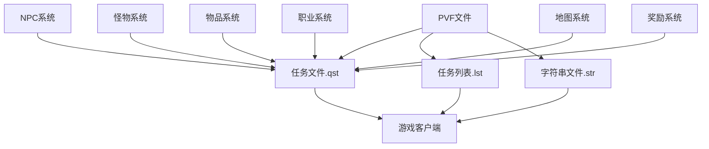

# DNF任务文件依赖关系

## 📊 依赖关系图



## 🔄 文件关联机制

### 1. 任务文件(.qst) 与 任务列表(.lst)
- **关联类型**: 强依赖
- **作用机制**: 
  - `quest.lst`定义了任务ID与实际.qst文件的关联
  - 任务文件(.qst)负责任务的实际参数和功能实现
  - 任务列表引用任务文件路径，建立索引关系

### 2. PVF文件 与 任务文件
- **关联类型**: 核心依赖
- **作用机制**:
  - PVF文件存储任务的详细参数和属性
  - 任务文件(.qst)使用这些参数实现游戏逻辑
  - 修改PVF文件直接影响任务行为

### 3. 字符串文件(.str) 与 任务显示
- **关联类型**: 显示依赖
- **作用机制**:
  - .str文件提供任务在游戏中显示的名称和描述
  - 与任务列表中的ID关联
  - 修改不影响游戏功能但影响显示文本

### 4. NPC系统 与 任务触发
- **关联类型**: 触发依赖
- **作用机制**:
  - NPC系统定义任务接受和完成的交互点
  - 任务文件通过NPC编号关联特定NPC
  - 控制任务的接取和提交

### 5. 怪物/物品系统 与 任务条件
- **关联类型**: 条件依赖
- **作用机制**:
  - 任务可能需要击杀特定怪物或收集特定物品
  - 任务文件引用怪物/物品ID
  - 通过ID关联具体怪物/物品参数

## 🔗 依赖关系详解

### 核心依赖路径
```
quest.lst(列表关联) 
    ↓
任务文件(.qst) 
    ↓
.kor.str(显示文本) 
    ↓
游戏客户端显示
```

### 条件依赖路径
```
任务文件(.qst)中的[int data]
    ↓
怪物ID/物品ID引用
    ↓
怪物/物品参数文件
    ↓
条件达成检测
```

### 调用机制
1. **客户端请求**: 玩家与NPC交互接取任务
2. **列表解析**: 解析quest.lst找到.qst路径
3. **参数加载**: 加载对应任务的.qst文件参数
4. **条件检测**: 监控任务完成条件达成
5. **奖励发放**: 任务完成后发放奖励

### 影响链路
- 修改.qst文件 → 任务条件改变 → 玩家体验变化
- 修改.quest.lst → 任务关联改变 → 游戏内容变化
- 修改.kor.str → 任务名称改变 → 玩家界面变化
- 修改NPC关联 → 任务接取点改变 → 玩家流程变化

## 📁 目录结构依赖

### 任务文件依赖
```
quest.lst
    ↓
/quest/目录下任务文件
    ↓
.quest.kor.str文件中的任务名称和描述
    ↓
相关NPC、怪物、物品文件
```

### 条件关联依赖
- `/quest/` - 任务参数文件目录
- `/monster/` - 怪物参数文件（杀怪任务）
- `/stackable/` - 物品参数文件（收集任务）
- `/map/` - 地图参数文件（通关任务）

## ⚠️ 依赖注意事项

1. **强依赖**: quest.lst修改错误会导致游戏无法识别任务
2. **同步修改**: 修改任务文件时，确保列表和显示文本也同步更新
3. **兼容性检查**: 确保修改不破坏现有依赖关系
4. **备份策略**: 修改前备份原文件，确保可回滚

## 🔍 关键依赖文件

### 任务相关
- `quest.lst` - 任务列表与任务文件的关联
- `/quest/` - 任务参数文件目录
- `quest.kor.str` - 任务名称和描述显示文件

### NPC关联
- NPC配置文件（任务接取点）
- `npc.lst` - NPC列表文件

### 条件相关
- `/monster/` - 怪物参数文件（杀怪任务相关）
- `/stackable/` - 物品参数文件（收集任务相关）
- `/map/` - 地图参数文件（通关任务相关）

### 奖励系统关联
- 物品奖励配置文件
- 经验奖励配置文件
- 金币奖励配置文件

### 权限系统关联
- 职业限制配置文件
- 等级限制配置文件
- PVP等级限制配置文件

---
*本依赖关系文件旨在帮助理解DNF任务系统中各文件的相互关系*