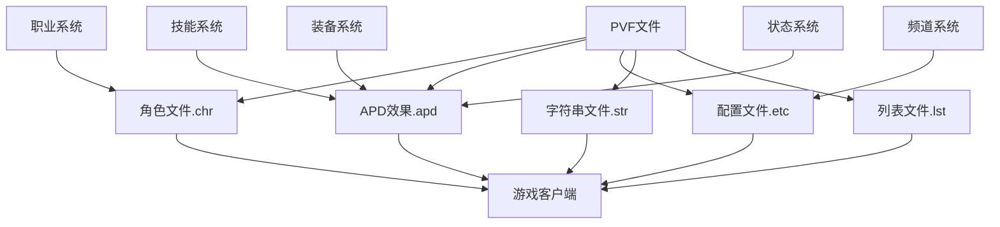

# DNF其他PVF杂项文件依赖关系

## 📊 依赖关系图



## 🔄 文件关联机制

### 1. 角色文件(.chr) 与 职业系统
- **关联类型**: 强依赖
- **作用机制**: 
  - 角色文件定义了职业的基础参数
  - 职业系统读取角色文件实现职业功能
  - 通过角色列表文件建立关联

### 2. APD文件(.apd) 与 效果系统
- **关联类型**: 功能依赖
- **作用机制**:
  - APD文件定义了各种效果参数
  - 装备、技能等调用APD效果
  - 实现状态改变、外观变化等功能

### 3. 配置文件(.etc) 与 系统设置
- **关联类型**: 配置依赖
- **作用机制**:
  - 配置文件存储系统参数
  - 游戏系统读取配置实现功能
  - 控制金币上限、频道设置等

### 4. 字符串文件(.str) 与 显示系统
- **关联类型**: 显示依赖
- **作用机制**:
  - 字符串文件提供显示文本
  - 与ID关联实现名称显示
  - 控制界面文字内容

### 5. 列表文件(.lst) 与 文件索引
- **关联类型**: 索引依赖
- **作用机制**:
  - 列表文件建立文件路径索引
  - 系统通过列表文件定位具体文件
  - 控制文件加载顺序

## 🔗 依赖关系详解

### 角色系统依赖路径
```
character.lst(角色列表) 
    ↓
角色参数文件(.chr) 
    ↓
character.kor.str(职业名称)
    ↓
职业功能实现
```

### APD效果依赖路径
```
装备/技能调用
    ↓
APD效果文件(.apd)
    ↓
状态/外观改变
    ↓
视觉效果
```

### 频道系统依赖路径
```
频道配置文件(.etc)
    ↓
频道数量/名称设置
    ↓
频道列表显示
    ↓
玩家连接
```

### 调用机制
1. **客户端请求**: 玩家触发特定功能
2. **配置读取**: 读取相关.etc配置文件
3. **参数加载**: 加载.chr或.apd参数
4. **效果应用**: 应用配置和效果参数
5. **功能实现**: 执行具体功能

### 影响链路
- 修改.chr文件 → 职业参数改变 → 角色功能变化
- 修改.apd文件 → 效果参数改变 → 视觉效果变化
- 修改.etc文件 → 系统设置改变 → 游戏规则变化
- 修改.str文件 → 显示文本改变 → 界面显示变化

## 📁 目录结构依赖

### 角色系统依赖
```
character.lst
    ↓
character/目录下职业文件
    ↓
各职业参数文件
    ↓
character.kor.str职业名称
```

### APD系统依赖
```
appendage/目录
    ↓
APD效果文件
    ↓
装备/技能调用
    ↓
实际效果应用
```

### 配置系统依赖
```
etc/目录
    ↓
各类配置文件
    ↓
系统参数设置
    ↓
游戏规则生效
```

## ⚠️ 依赖注意事项

1. **强依赖**: lst文件修改错误会导致系统无法定位文件
2. **同步修改**: 修改功能文件时，确保关联配置也同步更新
3. **兼容性检查**: 确保修改不破坏现有依赖关系
4. **备份策略**: 修改前备份原文件，确保可回滚

## 🔍 关键依赖文件

### 角色相关
- `character.lst` - 角色列表与参数文件关联
- `/character/` - 角色参数文件目录
- `character.kor.str` - 职业名称显示文件

### APD效果相关
- `/appendage/` - APD效果文件目录
- 效果配置文件
- 调用效果的装备/技能文件

### 系统配置相关
- `etc/goldlimibylevel.etc` - 金币上限配置
- `etc/worlddrop.etc` - 怪物掉落配置
- `etc/tw_deleteinvaliditem.etc` - 物品回收配置

### 显示系统关联
- 各类.str文件 - 显示文本
- UI配置文件
- 界面显示相关文件

### 频道系统关联
- 频道配置文件
- 网络连接相关文件
- 玩家管理相关文件

---
*本依赖关系文件旨在帮助理解DNF其他PVF杂项系统中各文件的相互关系*