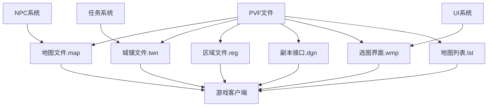

# DNF地图城镇文件依赖关系

## 📊 依赖关系图



## 🔄 文件关联机制

### 1. 地图文件(.map) 与 城镇系统
- **关联类型**: 核心依赖
- **作用机制**: 
  - 地图文件(.map)包含实际的地图内容和布局
  - 城镇文件(.twn)通过[area]标签引用地图文件
  - 列表文件(.lst)建立ID与路径的关联

### 2. 城镇文件(.twn) 与 区域管理
- **关联类型**: 管理依赖
- **作用机制**:
  - 城镇文件管理单个城镇的多个地图
  - 通过[area]标签定义地图区域
  - 包含等级限制、前置任务等访问控制

### 3. 选图界面(.wmp) 与 副本接口
- **关联类型**: 界面依赖
- **作用机制**:
  - 选图界面显示副本入口
  - 通过ID调用副本接口
  - UI文件控制界面布局

### 4. 区域文件(.reg) 与 城镇管理
- **关联类型**: 分组依赖
- **作用机制**:
  - 区域文件管理多个城镇
  - 通过城镇ID关联具体城镇
  - 控制大区内的城镇访问

### 5. NPC/任务系统 与 地图访问
- **关联类型**: 访问依赖
- **作用机制**:
  - NPC系统控制地图访问路径
  - 任务系统设置前置条件
  - 限制玩家访问特定区域

## 🔗 依赖关系详解

### 核心依赖路径
```
region.reg(区域定义) 
    ↓
town.twn(城镇定义) 
    ↓
map.map(地图内容) 
    ↓
游戏客户端渲染
```

### 副本访问路径
```
worldmap.wmp(选图界面) 
    ↓
dungeon.dgn(副本接口) 
    ↓
map.map(副本地图) 
    ↓
副本体验
```

### 列表管理路径
```
map.lst(地图列表)
    ↓
map.map文件路径
    ↓
地图ID管理
    ↓
系统识别
```

### 调用机制
1. **客户端请求**: 玩家选择进入某个区域
2. **区域解析**: 解析region.reg找到对应城镇
3. **城镇加载**: 加载town.twn获取地图列表
4. **地图渲染**: 加载map.map显示具体内容
5. **功能激活**: 激活NPC、任务等附加功能

### 影响链路
- 修改.map文件 → 地图内容改变 → 玩家体验变化
- 修改.twn文件 → 城镇属性改变 → 访问权限变化
- 修改.lst文件 → ID映射改变 → 系统识别变化
- 修改.wmp文件 → 选图界面改变 → 玩家选择变化

## 📁 目录结构依赖

### 地图文件依赖
```
map.lst
    ↓
/map/目录下地图文件
    ↓
城镇地图或副本地图
    ↓
相关NPC、怪物配置
```

### 城镇管理依赖
```
town.lst
    ↓
/town/目录下城镇文件
    ↓
各城镇配置(.twn)
    ↓
对应地图文件关联
```

### 区域管理依赖
```
region.lst
    ↓
/region/目录下区域文件
    ↓
各区域配置(.reg)
    ↓
包含城镇ID列表
```

### 选图界面依赖
```
worldmap.lst
    ↓
/worldmap/目录下界面文件
    ↓
UI界面配置
    ↓
副本接口关联
```

## ⚠️ 依赖注意事项

1. **强依赖**: .lst文件修改错误会导致系统无法识别地图
2. **同步修改**: 修改地图文件时，确保列表和关联也同步更新
3. **兼容性检查**: 确保修改不破坏现有依赖关系
4. **备份策略**: 修改前备份原文件，确保可回滚

## 🔍 关键依赖文件

### 地图相关
- `map.lst` - 地图列表与地图文件的关联
- `/map/` - 地图参数文件目录
- `map.kor.str` - 地图名称显示文件

### 城镇相关
- `town.lst` - 城镇列表与城镇文件的关联
- `/town/` - 城镇参数文件目录
- 城镇名称和配置文件

### 区域相关
- `region.lst` - 区域列表与区域文件的关联
- `/region/` - 区域参数文件目录

### 副本接口相关
- `dungeon.lst` - 副本接口列表
- `/dungeon/` - 副本接口参数文件

### 选图界面相关
- `worldmap.lst` - 选图界面列表
- `/worldmap/` - 选图界面参数文件
- UI界面配置文件

### 系统关联
- `/npc/` - NPC配置文件（地图中NPC）
- `/quest/` - 任务配置文件（前置任务）
- UI界面相关文件

---
*本依赖关系文件旨在帮助理解DNF地图城镇系统中各文件的相互关系*