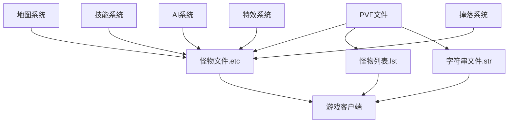

# DNF怪物文件依赖关系

## 📊 依赖关系图



## 🔄 文件关联机制

### 1. 怪物文件(.etc) 与 怪物列表(.lst)
- **关联类型**: 强依赖
- **作用机制**: 
  - `monster.lst`定义了怪物ID与实际etc文件的关联
  - 怪物文件(.etc)负责怪物的实际参数和功能实现
  - 怪物列表引用怪物文件路径，建立索引关系

### 2. PVF文件 与 怪物文件
- **关联类型**: 核心依赖
- **作用机制**:
  - PVF文件存储怪物的详细参数和属性
  - 怪物文件(.etc)使用这些参数实现游戏逻辑
  - 修改PVF文件直接影响怪物表现

### 3. 字符串文件(.str) 与 怪物显示
- **关联类型**: 显示依赖
- **作用机制**:
  - .str文件提供怪物在游戏中显示的名称
  - 与怪物列表中的ID关联
  - 修改不影响游戏功能但影响显示文本

### 4. 地图系统 与 怪物生成
- **关联类型**: 生成依赖
- **作用机制**:
  - 地图系统定义怪物刷新位置和数量
  - 怪物文件基于地图配置生成
  - 通过地图配置控制怪物出现

### 5. 技能系统 与 怪物技能
- **关联类型**: 战斗增强
- **作用机制**:
  - 怪物可能使用特定技能
  - 技能ID与技能系统关联
  - 通过内部参数实现战斗行为

## 🔗 依赖关系详解

### 核心依赖路径
```
monster.lst(列表关联) 
    ↓
怪物文件(.etc) 
    ↓
.kor.str(显示名称) 
    ↓
游戏客户端显示
```

### 调用机制
1. **客户端请求**: 游戏客户端根据地图配置请求怪物
2. **列表解析**: 解析monster.lst找到.etc路径
3. **参数加载**: 加载对应怪物的.etc文件参数
4. **名称显示**: 从.kor.str获取怪物名称
5. **功能执行**: 读取怪物参数实现AI和战斗功能

### 影响链路
- 修改.etc文件 → 怪物属性改变 → 战斗体验变化
- 修改.monster.lst → 怪物关联改变 → 游戏内容变化
- 修改.kor.str → 怪物名称改变 → 玩家界面变化
- 修改地图配置 → 怪物出现位置改变 → 游戏流程变化

## 📁 目录结构依赖

### 怪物文件依赖
```
monster.lst
    ↓
/monster/目录下怪物文件
    ↓
monster.kor.str文件中的怪物名称
    ↓
各种特效和动画资源文件
```

### 技能关联依赖
```
怪物文件(.etc)
    ↓
[throw attack]等技能引用
    ↓
对应的.ptl特效文件
    ↓
技能系统参数
```

### AI参数依赖
- `/monster/` - 怪物基础参数文件
- `*.ptl` - 怪物特效文件
- `*.ani` - 怪物动画文件
- `*.obj` - 怪物对象文件

## ⚠️ 依赖注意事项

1. **强依赖**: monster.lst修改错误会导致游戏无法识别怪物
2. **同步修改**: 修改怪物文件时，确保列表和名称也同步更新
3. **兼容性检查**: 确保修改不破坏现有依赖关系
4. **备份策略**: 修改前备份原文件，确保可回滚

## 🔍 关键依赖文件

### 怪物相关
- `monster.lst` - 怪物列表与怪物文件的关联
- `/monster/` - 怪物参数文件目录
- `monster.kor.str` - 怪物名称显示文件

### 技能关联
- `skill.lst` - 技能列表（当怪物使用技能时）
- `/skill/` - 技能参数文件（当怪物使用技能时）

### 特效关联
- `*.ptl` - 特效资源文件
- `*.ani` - 动画配置文件
- `*.obj` - 对象配置文件
- `/particle/` - 粒子特效目录

### AI系统关联
- AI参数配置文件
- 怪物AI脚本文件
- 行为逻辑配置文件

### 掉落系统关联
- 掉落配置文件
- 物品关联表

---
*本依赖关系文件旨在帮助理解DNF怪物系统中各文件的相互关系*