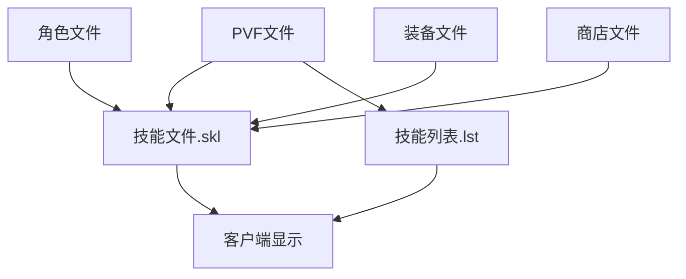

# DNF技能文件依赖关系

## 📊 依赖关系图



## 🔄 文件关联机制

### 1. 技能文件(.skl) 与 技能列表(.lst)
- **关联类型**: 强依赖
- **作用机制**: 
  - `swordmanskill.lst`定义了技能在游戏中的展示顺序
  - 技能文件(.skl)负责技能的实际功能实现
  - 技能列表引用技能文件路径，建立索引关系

### 2. PVF文件 与 技能文件
- **关联类型**: 核心依赖
- **作用机制**:
  - PVF文件存储技能的详细参数和属性
  - 技能文件(.skl)使用这些参数实现游戏逻辑
  - 修改PVF文件直接影响技能效果

### 3. 角色文件 与 技能文件
- **关联类型**: 适配依赖
- **作用机制**:
  - 角色文件定义职业特性
  - 技能文件根据职业特性调整功能
  - 通过[skill fitness growtype]参数控制职业学习权限

### 4. 装备文件 与 技能文件
- **关联类型**: 效果增强
- **作用机制**:
  - 装备文件中的属性可以影响技能效果
  - 某些装备可能解锁特殊技能或能力
  - 通过内部参数实现联动效果

### 5. 商店文件 与 技能文件
- **关联类型**: 激活依赖
- **作用机制**:
  - 商店文件可能销售技能书
  - 技能书用于解锁或升级技能
  - 需要确保商店文件与技能文件参数匹配

## 🔗 依赖关系详解

### 核心依赖路径
```
PVF文件(技能参数) 
    ↓
技能文件(.skl) 
    ↓
技能列表文件(.lst) 
    ↓
客户端显示
```

### 调用机制
1. **客户端请求**: 游戏客户端根据技能列表显示技能
2. **参数加载**: 加载对应技能的PVF参数
3. **功能执行**: 执行技能文件(.skl)中的逻辑
4. **结果反馈**: 将技能效果反馈给客户端

### 影响链路
- 修改技能文件(.skl) → 技能功能改变 → 游戏体验变化
- 修改技能列表(.lst) → 技能排序改变 → 玩家操作体验
- 修改PVF参数 → 技能数值变化 → 游戏平衡调整
- 修改职业适配参数 → 技能可学性改变 → 职业发展路径

## ⚠️ 依赖注意事项

1. **同步修改**: 修改技能文件时，确保相关列表和参数同步更新
2. **兼容性检查**: 确保修改不破坏现有依赖关系
3. **测试验证**: 修改后需验证所有依赖路径是否正常工作
4. **备份策略**: 修改前备份原文件，确保可回滚

---
*本依赖关系文件旨在帮助理解DNF技能系统中各文件的相互关系*