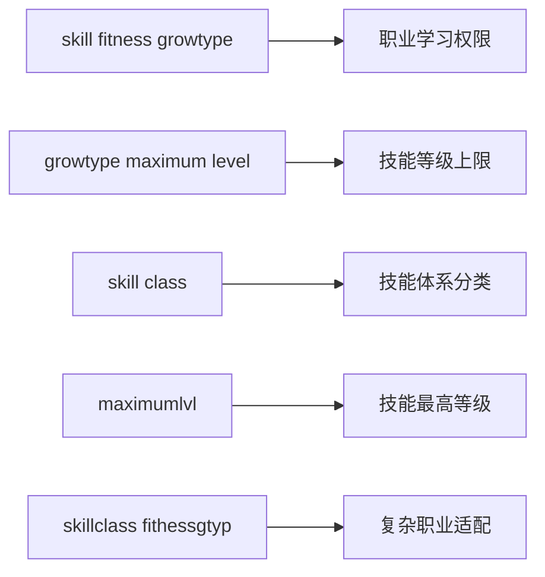

# DNF技能修改核心标签参考

## 🏷️ 核心标签详解

### [skill class]
- **功能作用**: 定义技能所属的技能体系，不同职业可能有不同的技能体系分类
- **参数详解**: 
  - 类型: 数值型
  - 作用: 区分技能类型和所属体系
  - 取值范围: 根据游戏版本而定
  - 默认值: 根据技能类型确定
- **实际应用**: 用于控制哪些职业可以使用特定类型的技能
- **依赖关系**: 与[skill fitness growtype]和职业配置相关联

### [growtype maximum level]
- **功能作用**: 定义每个职业可以学习此技能的最大等级
- **参数详解**: 
  - 类型: 数组型（包含6个数值）
  - 作用: 控制不同职业的技能等级上限
  - 取值范围: 通常为0-20之间
  - 对应关系: [鬼剑, 剑魂, 鬼泣, 狂战, 阿修罗, 征服者]
- **实际应用**: 用于平衡不同职业的技能强度
- **依赖关系**: 与技能等级系统和职业发展相关

### [skill fitness growtype]
- **功能作用**: 控制哪些职业可以学习该技能
- **参数详解**: 
  - 类型: 数值型
  - 作用: 定义技能对职业的适配性
  - 取值范围: 0-5
  - 取值含义: 0-鬼剑, 1-剑魂, 2-鬼泣, 3-狂战, 4-阿修罗
- **实际应用**: 用于实现技能的职业差异化
- **依赖关系**: 与职业系统和技能学习系统关联

### maximumlvl
- **功能作用**: 定义技能最高等级限制
- **参数详解**: 
  - 类型: 数值型
  - 作用: 限制技能可学习的最高等级
  - 取值范围: 1-20
  - 默认值: 根据技能类型确定
- **实际应用**: 控制技能的成长上限
- **依赖关系**: 与技能升级和SP分配系统相关

### skillclass 和 fithessgtyp
- **功能作用**: 技能分类和职业适配参数
- **参数详解**: 
  - 类型: 数值型
  - 作用: 组合控制技能的职业适配性
  - 取值范围: 根据职业系统而定
- **实际应用**: 用于实现复杂的职业技能适配逻辑
- **依赖关系**: 与职业系统深度关联

## 🧩 技能文件结构

### 技能列表文件(.lst)
- **功能**: 定义技能在游戏中的显示顺序
- **格式**: 
  ```
  1 "Swordman/Guard.skl" 格挡
  2 "Swordman/ReflectGuard.skl" 鬼印珠
  3 "Swordman/AutoGuard.skl" 自动格挡
  ```
- **应用**: 用于控制技能面板的布局和顺序
- **依赖**: 与技能文件(.skl)和客户端显示系统相关

### 技能文件(.skl)
- **功能**: 包含技能的具体实现逻辑
- **内容**: 技能效果、动画、音效等资源引用
- **应用**: 实现技能的具体游戏功能
- **依赖**: 与资源文件和游戏引擎相关

## 🎮 实际应用场景

### 1. 技能整合
- **场景**: 将多个职业技能整合到一个角色上
- **实现**: 调整[skill fitness growtype]参数
- **注意**: 需要平衡不同职业的技能强度

### 2. 技能等级调整
- **场景**: 调整特定技能的最高等级
- **实现**: 修改[growtype maximum level]和maximumlvl参数
- **注意**: 避免造成数值不平衡

### 3. 职业差异化
- **场景**: 为不同职业设计独特的技能
- **实现**: 通过[skill fitness growtype]参数控制
- **注意**: 确保职业特色和平衡性

## ⚠️ 使用建议

1. **参数关联**: 修改一个参数时，检查相关参数是否需要同步调整
2. **测试验证**: 修改后进行全面测试，确保技能正常工作
3. **文档记录**: 记录参数修改的原因和影响，便于后续维护
4. **备份策略**: 修改前备份原配置，防止错误操作导致游戏异常

## 📊 参数关系图



---
*本标签参考文档基于DAF学院技能修改教程整理，旨在为开发者提供技能参数的详细说明*