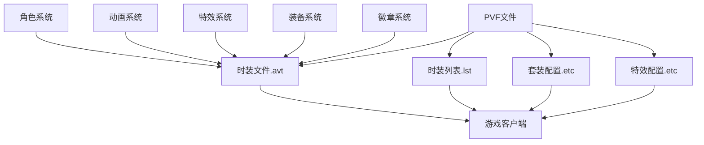

# DNF时装文件依赖关系

## 📊 依赖关系图



## 🔄 文件关联机制

### 1. 时装文件(.avt) 与 时装列表(.lst)
- **关联类型**: 强依赖
- **作用机制**: 
  - `avatar.lst`定义了时装ID与实际.avt文件的关联
  - 时装文件(.avt)负责时装的实际参数和功能实现
  - 时装列表引用时装文件路径，建立索引关系

### 2. 时装文件 与 套装系统
- **关联类型**: 功能依赖
- **作用机制**:
  - `etc/equipmentpartset.etc`管理时装套装效果
  - 通过`part set index`与套装配置关联
  - 控制套装属性和特效

### 3. 时装文件 与 特效系统
- **关联类型**: 显示依赖
- **作用机制**:
  - `etc/additionaleffectlist.etc`管理附加特效
  - 通过`effect part set index`关联特效
  - 控制时装特效显示

### 4. 角色系统 与 时装适配
- **关联类型**: 适配依赖
- **作用机制**:
  - 角色系统定义职业特性
  - 时装文件根据职业设置`usable job`
  - 控制时装的职业适配性

### 5. 动画系统 与 时装外观
- **关联类型**: 外观依赖
- **作用机制**:
  - 动画系统管理角色动作
  - 时装文件通过`animation job`和`variation`关联
  - 控制时装的外观表现

## 🔗 依赖关系详解

### 核心依赖路径
```
avatar.lst(列表关联) 
    ↓
时装文件(.avt) 
    ↓
etc/equipmentpartset.etc(套装配置) 
    ↓
etc/additionaleffectlist.etc(特效配置)
    ↓
游戏客户端显示
```

### 套装系统依赖路径
```
part set index(套装索引)
    ↓
etc/equipmentpartset.etc
    ↓
套装效果配置
    ↓
套装属性激活
```

### 特效系统依赖路径
```
effect part set index(特效索引)
    ↓
etc/additionaleffectlist.etc
    ↓
etc/equipmenteffectset.etc
    ↓
时装特效激活
```

### 调用机制
1. **客户端请求**: 玩家装备时装
2. **列表解析**: 解析avatar.lst找到.avt路径
3. **参数加载**: 加载对应时装的.avt文件参数
4. **套装检测**: 检查套装效果激活条件
5. **特效应用**: 应用相关特效和动画

### 影响链路
- 修改.avt文件 → 时装属性改变 → 角色外观变化
- 修改.avatar.lst → 时装关联改变 → 游戏内容变化
- 修改套装配置 → 套装效果改变 → 多件时装协同变化
- 修改特效配置 → 特效表现改变 → 视觉体验变化

## 📁 目录结构依赖

### 时装文件依赖
```
avatar.lst
    ↓
/avatar/目录下时装文件
    ↓
.avs文件(外观资源)
    ↓
.kor.str文件中的时装名称
```

### 套装配置依赖
```
etc/equipmentpartset.etc
    ↓
part set index关联
    ↓
套装效果激活
    ↓
套装属性加成
```

### 特效配置依赖
```
etc/additionaleffectlist.etc
    ↓
etc/equipmenteffectset.etc
    ↓
特效资源文件
    ↓
时装特效表现
```

## ⚠️ 依赖注意事项

1. **强依赖**: avatar.lst修改错误会导致游戏无法识别时装
2. **同步修改**: 修改时装文件时，确保套装和特效配置也同步更新
3. **兼容性检查**: 确保修改不破坏现有依赖关系
4. **备份策略**: 修改前备份原文件，确保可回滚

## 🔍 关键依赖文件

### 时装相关
- `avatar.lst` - 时装列表与时装文件的关联
- `/avatar/` - 时装参数文件目录
- `avatar.kor.str` - 时装名称显示文件

### 套装系统相关
- `etc/equipmentpartset.etc` - 时装套装配置文件
- `etc/equipmenteffectset.etc` - 时装特效集配置

### 特效系统相关
- `etc/additionaleffectlist.etc` - 附加效果列表
- 特效资源文件
- 动画配置文件

### 角色系统关联
- `/animation/` - 动画配置目录
- `/equipment/character/` - 装备角色配置
- `/lay/` - 层级配置文件

### 徽章系统关联
- 徽章插槽配置文件
- S/C/M socket相关配置
- 徽章效果配置文件

---
*本依赖关系文件旨在帮助理解DNF时装系统中各文件的相互关系*