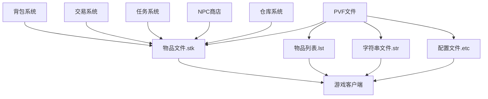

# DNF物品文件依赖关系

## 📊 依赖关系图



## 🔄 文件关联机制

### 1. 物品文件(.stk) 与 物品列表(.lst)
- **关联类型**: 强依赖
- **作用机制**: 
  - `stackable.lst`定义了物品ID与实际.stk文件的关联
  - 物品文件(.stk)负责物品的实际参数和功能实现
  - 物品列表引用物品文件路径，建立索引关系

### 2. 物品文件 与 字符串系统
- **关联类型**: 显示依赖
- **作用机制**:
  - `*.str`文件提供物品在游戏中显示的名称和说明
  - 与物品列表中的ID关联
  - 修改不影响游戏功能但影响显示文本

### 3. 背包系统 与 物品配置
- **关联类型**: 管理依赖
- **作用机制**:
  - 背包系统管理物品的堆叠和存储
  - 通过`[stackable type]`和`[max count]`参数控制
  - 控制物品的堆叠数量和存储限制

### 4. 交易系统 与 物品限制
- **关联类型**: 权限依赖
- **作用机制**:
  - 交易系统管理物品的交易权限
  - 通过`[attach type]`参数控制交易类型
  - 控制物品的交易限制

### 5. 任务系统 与 物品关联
- **关联类型**: 功能依赖
- **作用机制**:
  - 任务系统检测特定物品的获得和使用
  - 物品可能触发任务条件
  - 控制任务相关物品的功能

## 🔗 依赖关系详解

### 核心依赖路径
```
stackable.lst(列表关联) 
    ↓
物品文件(.stk) 
    ↓
.kor.str(显示文本) 
    ↓
游戏客户端显示
```

### 礼包系统依赖路径
```
礼包.stk文件
    ↓
[item function]配置
    ↓
[random select]随机内容
    ↓
内部物品ID关联
```

### 魔盒系统依赖路径
```
魔盒.stk文件
    ↓
[stackable type]类型定义
    ↓
[random]随机系统
    ↓
[default list]内容列表
```

### 调用机制
1. **客户端请求**: 玩家使用物品
2. **列表解析**: 解析stackable.lst找到.stk路径
3. **参数加载**: 加载对应物品的.stk文件参数
4. **功能执行**: 根据参数执行物品功能
5. **效果应用**: 应用物品效果

### 影响链路
- 修改.stk文件 → 物品属性改变 → 玩家体验变化
- 修改.stackable.lst → 物品关联改变 → 游戏内容变化
- 修改.kor.str → 物品名称改变 → 玩家界面变化
- 修改交易类型 → 物品流通变化 → 经济系统影响

## 📁 目录结构依赖

### 物品文件依赖
```
stackable.lst
    ↓
/stackable/目录下物品文件
    ↓
各种子目录(消耗品/材料/礼包等)
    ↓
.kor.str文件中的物品名称
```

### 物品分类依赖
- `/stackable/consumable/` - 消耗品目录
- `/stackable/material/` - 材料目录  
- `/stackable/event/` - 活动物品目录
- `/stackable/cash/` - 现金物品目录

### 系统关联依赖
- `/stackable/` - 物品参数文件目录
- `stackable.kor.str` - 物品名称显示文件
- 物品功能相关配置文件

## ⚠️ 依赖注意事项

1. **强依赖**: stackable.lst修改错误会导致游戏无法识别物品
2. **同步修改**: 修改物品文件时，确保列表和显示文本也同步更新
3. **兼容性检查**: 确保修改不破坏现有依赖关系
4. **备份策略**: 修改前备份原文件，确保可回滚

## 🔍 关键依赖文件

### 物品相关
- `stackable.lst` - 物品列表与物品文件的关联
- `/stackable/` - 物品参数文件目录
- `stackable.kor.str` - 物品名称显示文件

### 背包系统关联
- 背包配置文件
- 堆叠限制配置文件
- 仓库系统相关文件

### 交易系统关联
- 交易限制配置文件
- 绑定类型定义文件
- 交易规则配置文件

### 任务系统关联
- 任务物品配置文件
- 任务条件检测文件
- 任务奖励配置文件

### NPC商店关联
- 商店物品配置文件
- 价格设置文件
- 可购买限制文件

---
*本依赖关系文件旨在帮助理解DNF物品系统中各文件的相互关系*