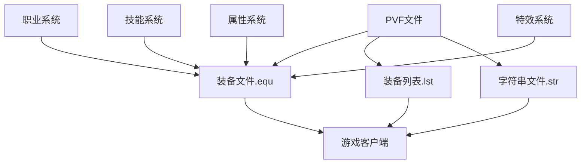

# DNF装备文件依赖关系

## 📊 依赖关系图



## 🔄 文件关联机制

### 1. 装备文件(.equ) 与 装备列表(.lst)
- **关联类型**: 强依赖
- **作用机制**: 
  - `equipment.lst`定义了装备ID与实际.equip文件的关联
  - 装备文件(.equ)负责装备的实际参数和功能实现
  - 装备列表引用装备文件路径，建立索引关系

### 2. PVF文件 与 装备文件
- **关联类型**: 核心依赖
- **作用机制**:
  - PVF文件存储装备的详细参数和属性
  - 装备文件(.equ)使用这些参数实现游戏逻辑
  - 修改PVF文件直接影响装备效果

### 3. 字符串文件(.str) 与 装备显示
- **关联类型**: 显示依赖
- **作用机制**:
  - .str文件提供装备在游戏中显示的名称
  - 与装备列表中的ID关联
  - 修改不影响游戏功能但影响显示文本

### 4. 职业系统 与 装备适配
- **关联类型**: 适配依赖
- **作用机制**:
  - 职业系统定义职业特性
  - 装备文件根据职业特性调整功能
  - 通过职业标签控制职业使用权限

### 5. 技能系统 与 装备技能
- **关联类型**: 功能增强
- **作用机制**:
  - 装备可能添加或增强技能
  - 技能ID与技能系统关联
  - 通过内部参数实现联动效果

## 🔗 依赖关系详解

### 核心依赖路径
```
equipment.lst(列表关联) 
    ↓
装备文件(.equ) 
    ↓
.kor.str(显示名称) 
    ↓
游戏客户端显示
```

### 调用机制
1. **客户端请求**: 游戏客户端通过ID请求装备
2. **列表解析**: 解析equipment.lst找到.equip路径
3. **参数加载**: 加载对应装备的.equip文件参数
4. **名称显示**: 从.kor.str获取装备名称
5. **功能执行**: 读取装备参数实现游戏功能

### 影响链路
- 修改.equip文件 → 装备功能改变 → 角色属性变化
- 修改.equipment.lst → 装备关联改变 → 游戏内容变化
- 修改.kor.str → 装备名称改变 → 玩家界面变化
- 修改职业适配参数 → 装备可使用性改变 → 职业发展路径

## 📁 目录结构依赖

### 通用装备依赖
```
equipment.lst
    ↓
/equipment/character/common/目录下装备文件
    ↓
.kor.str文件中的装备名称
```

### 职业装备依赖
```
equipment.lst
    ↓
/equipment/character/[职业名]/目录下装备文件
    ↓
.kor.str文件中的装备名称
```

### 装备分类依赖
- `/equipment/character/common/jacket/` - 上衣类装备
- `/equipment/character/common/ring/` - 戒指类装备  
- `/equipment/character/common/weapon/` - 武器类装备
- 等等...

## ⚠️ 依赖注意事项

1. **强依赖**: equipment.lst修改错误会导致游戏无法识别装备
2. **同步修改**: 修改装备文件时，确保列表和名称也同步更新
3. **兼容性检查**: 确保修改不破坏现有依赖关系
4. **备份策略**: 修改前备份原文件，确保可回滚

## 🔍 关键依赖文件

### 装备相关
- `equipment.lst` - 装备列表与装备文件的关联
- `/equipment/character/common/` - 通用装备参数文件
- `/equipment/character/[职业名]/` - 职业装备参数文件
- `*.kor.str` - 装备名称显示文件

### 技能关联
- `skill.lst` - 技能列表（当装备涉及技能时）
- `/skill/` - 技能参数文件（当装备影响技能时）

### 特效关联
- 特效资源文件
- 动画配置文件
- 音效配置文件

---
*本依赖关系文件旨在帮助理解DNF装备系统中各文件的相互关系*