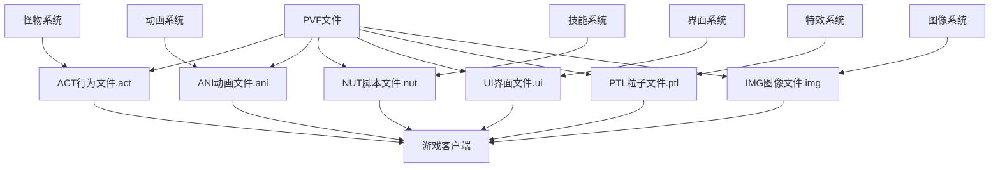

# DNF高级教程文件依赖关系

## 📊 依赖关系图



## 🔄 文件关联机制

### 1. ACT文件(.act) 与 怪物行为系统
- **关联类型**: 强依赖
- **作用机制**: 
  - ACT文件定义了怪物的行为逻辑
  - 怪物系统通过ACT文件控制行为
  - 包含动作、声音、触发器等配置

### 2. ANI文件(.ani) 与 动画系统
- **关联类型**: 动画依赖
- **作用机制**:
  - ANI文件定义动画播放逻辑
  - 与IMG图像文件配合实现视觉效果
  - 通过UI系统或装备系统调用

### 3. NUT文件(.nut) 与 技能系统
- **关联类型**: 逻辑依赖
- **作用机制**:
  - NUT文件实现复杂的技能逻辑
  - Squirrel脚本语言驱动
  - 与状态管理系统紧密关联

### 4. UI文件(.ui) 与 界面系统
- **关联类型**: 显示依赖
- **作用机制**:
  - UI文件定义界面布局和交互
  - 与游戏功能模块关联
  - 控制界面元素的显示和功能

### 5. PTL文件(.ptl) 与 特效系统
- **关联类型**: 视觉依赖
- **作用机制**:
  - PTL文件定义粒子特效效果
  - 通过ACT行为文件调用
  - 实现复杂的视觉特效

### 6. IMG文件(.img) 与 图像系统
- **关联类型**: 资源依赖
- **作用机制**:
  - IMG文件存储图像资源
  - 与ANI动画文件关联
  - 提供视觉素材

## 🔗 依赖关系详解

### ACT行为依赖路径
```
怪物配置文件(.equ)
    ↓
ACT行为文件(.act)
    ↓
ANI动画文件(.ani)
    ↓
IMG图像文件(.img)
    ↓
PTL粒子文件(.ptl)
```

### NUT脚本依赖路径
```
技能配置文件(.ski)
    ↓
NUT脚本文件(.nut)
    ↓
技能逻辑执行
    ↓
状态管理系统
    ↓
效果应用
```

### UI界面依赖路径
```
界面配置文件(.lst)
    ↓
UI界面文件(.ui)
    ↓
界面显示模块
    ↓
用户交互处理
```

### 调用机制
1. **客户端请求**: 玩家触发特定行为
2. **配置加载**: 加载对应的ACT/ANI/NUT/UI文件
3. **逻辑执行**: 执行脚本逻辑或播放动画
4. **视觉呈现**: 显示动画和特效
5. **界面交互**: 处理用户输入

### 影响链路
- 修改ACT文件 → 怪物行为改变 → 游戏体验变化
- 修改ANI文件 → 动画效果改变 → 视觉感受变化
- 修改NUT文件 → 技能逻辑改变 → 战斗机制变化
- 修改UI文件 → 界面显示改变 → 用户体验变化

## 📁 目录结构依赖

### ACT文件依赖
```
Script/monster/*.act
    ↓
Animation/*.ani
    ↓
Image/*.img
    ↓
Particle/*.ptl
```

### NUT文件依赖
```
Script/skill/*.nut
    ↓
Skill/*.ski
    ↓
StaticData/*.etc
    ↓
State/*.sta
```

### UI文件依赖
```
UI/*.ui
    ↓
ImagePacks2/*.npk
    ↓
界面资源配置
```

## ⚠️ 依赖注意事项

1. **强依赖**: ACT/NUT文件修改错误会导致功能异常
2. **同步修改**: 修改高级文件时，确保关联文件也同步更新
3. **兼容性检查**: 确保修改不破坏现有依赖关系
4. **备份策略**: 修改前备份原文件，确保可回滚

## 🔍 关键依赖文件

### 行为系统关联
- `Script/monster/` - 怪物行为文件目录
- `Animation/` - 动画文件目录
- `Particle/` - 粒子特效文件目录

### 脚本系统关联
- `Script/skill/` - 技能脚本文件目录
- `Skill/` - 技能配置文件目录
- `StaticData/` - 静态数据文件目录

### 界面系统关联
- `UI/` - 界面文件目录
- `ImagePacks2/` - 界面资源目录
- `UIConfig/` - 界面配置目录

### 特效系统关联
- `Particle/` - 粒子特效文件目录
- `Effect/` - 特效配置文件目录
- `Animation/` - 动画文件目录

### 图像系统关联
- `Image/` - 图像文件目录
- `Texture/` - 纹理文件目录
- `Sprites/` - 精灵文件目录

---
*本依赖关系文件旨在帮助理解DNF高级教程中各文件的相互关系*