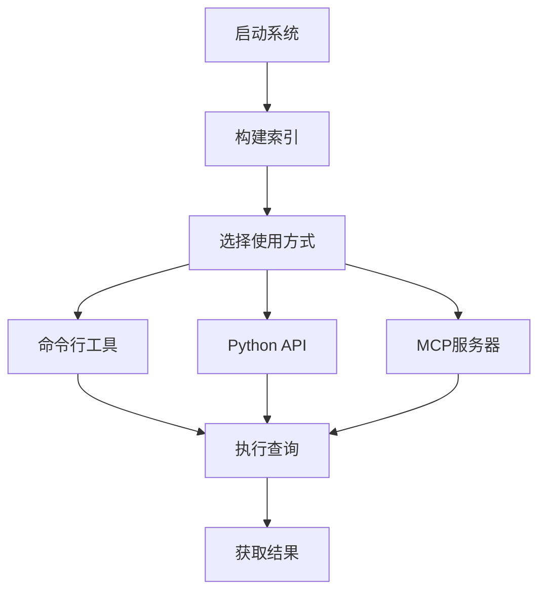

# 使用指南 📖

本文档详细介绍DNF知识库RAG系统的各项功能和使用方法，帮助您快速上手并充分利用系统的强大功能。

## 🎯 功能概览

DNF知识库RAG系统提供以下核心功能：

- 🔍 **智能检索**: 基于语义向量的知识库搜索
- 🤖 **AI问答**: 智能回答DNF文件相关问题
- 📋 **格式验证**: PVF文件格式检查和错误诊断
- 🔧 **MCP集成**: 与AI IDE无缝集成
- 📚 **知识管理**: 知识库索引构建和维护

## 🚀 快速开始

### 1. 首次使用准备

```bash
# 激活虚拟环境
source rag_env/bin/activate  # Linux/macOS
# 或
.\rag_env\Scripts\activate   # Windows

# 构建知识库索引（首次使用必需）
python start_rag.py --build-index

# 测试系统是否正常工作
python start_rag.py --test "如何修改装备属性？"
```

### 2. 基本使用流程



## 🛠️ 使用方式

### 方式一：命令行工具

#### 基本命令

```bash
# 构建知识库索引
python start_rag.py --build-index

# 启动RAG服务器
python start_rag.py --start-server

# 测试查询
python start_rag.py --test "你的问题"

# 一键构建并启动
python start_rag.py --all

# 查看帮助
python start_rag.py --help
```

#### 实际使用示例

```bash
# 查询装备相关问题
python start_rag.py --test "如何创建一个85级史诗武器？"

# 查询技能相关问题
python start_rag.py --test "技能文件中的伤害计算公式是什么？"

# 查询文件格式问题
python start_rag.py --test "PVF文件的基本结构是怎样的？"

# 查询错误排查问题
python start_rag.py --test "装备文件加载失败的常见原因有哪些？"
```

### 方式二：Python API

#### 基础API使用

```python
from simple_rag_server import SimpleDNFRAGServer

# 初始化服务器
server = SimpleDNFRAGServer(
    index_path="data/simple_index.pkl",
    config_path="config/config.json"
)

# 知识库检索
results = server.search("装备属性修改", k=5)
print("检索结果:")
for i, result in enumerate(results, 1):
    print(f"{i}. {result['content'][:100]}...")

# 智能问答
answer = server.generate_answer("如何创建一个新的85级太刀？")
print("AI回答:", answer)
```

#### 高级API使用

```python
import json
from simple_rag_server import SimpleDNFRAGServer
from enhanced_format_checker import EnhancedFormatChecker

# 初始化组件
server = SimpleDNFRAGServer("data/simple_index.pkl", "config/config.json")
checker = EnhancedFormatChecker("config/config.json")

# 批量查询处理
questions = [
    "如何修改装备的基础攻击力？",
    "技能冷却时间在哪个字段设置？",
    "地图文件的入口点如何配置？"
]

for question in questions:
    print(f"\n问题: {question}")
    answer = server.generate_answer(question)
    print(f"回答: {answer}")

# 文件格式验证
equipment_content = """
[name] `血影·鬼切`
[grade] 4
[rarity] 2
[usable job] `[swordman]`
[minimum level] 85
[physical attack] 800
[magical attack] 0
[attack speed] 1000
"""

result = checker.check_format(
    file_type="equ",
    content=equipment_content,
    sub_type="weapon",
    enhanced=True
)

print(f"格式验证结果: {result['status']}")
if result['errors']:
    print("发现的错误:")
    for error in result['errors']:
        print(f"- {error}")
```

### 方式三：MCP服务器集成

#### 启动MCP服务器

```bash
# 启动MCP服务器
python mcp_server.py

# 服务器将在标准输入/输出上运行MCP协议
# 通常由AI IDE（如Trae）自动管理
```

#### Trae IDE配置

在Trae IDE的MCP配置文件中添加：

```json
{
  "dnf_rag": {
    "command": "python",
    "args": ["mcp_server.py"],
    "cwd": "C:\\Users\\sen\\Desktop\\nut脚本\\86nut\\dnf_rag",
    "env": {
      "PYTHONPATH": "C:\\Users\\sen\\Desktop\\nut脚本\\86nut\\dnf_rag",
      "PYTHONIOENCODING": "utf-8",
      "DASHSCOPE_API_KEY": "your_api_key_here"
    }
  }
}
```

#### MCP工具使用

在支持MCP的AI IDE中，您可以直接使用以下工具：

1. **dnf_knowledge_search**: 搜索DNF知识库
2. **dnf_knowledge_qa**: 智能问答
3. **dnf_file_format_check**: 文件格式检查

## 📚 功能详解

### 1. 智能检索功能

#### 基本检索

```python
# 简单关键词检索
results = server.search("装备属性", k=5)

# 复杂语义检索
results = server.search("如何提高武器的攻击力和暴击率", k=10)

# 多语言检索
results = server.search("equipment attribute modification", k=5)
```

#### 检索结果处理

```python
for result in results:
    print(f"相关度: {result['score']:.3f}")
    print(f"来源: {result['source']}")
    print(f"内容: {result['content']}")
    print(f"元数据: {result['metadata']}")
    print("-" * 50)
```

#### 检索优化技巧

```python
# 1. 使用具体的关键词
good_query = "85级史诗太刀属性配置"
bad_query = "武器"

# 2. 包含上下文信息
good_query = "剑魂职业85级毕业武器推荐"
bad_query = "武器推荐"

# 3. 使用专业术语
good_query = "物理攻击力 魔法攻击力 属性强化"
bad_query = "攻击力"
```

### 2. AI问答功能

#### 基础问答

```python
# 简单问题
answer = server.generate_answer("装备的品级有哪些？")

# 复杂问题
answer = server.generate_answer(
    "我想创建一个85级的史诗太刀，名称为'血月斩魂刃'，"
    "攻击力800，带有火属性强化+20，请给出完整的装备文件代码。"
)

# 技术问题
answer = server.generate_answer(
    "在PVF文件中，如何设置装备的套装效果？"
    "需要哪些字段和参数？"
)
```

#### 问答优化策略

```python
# 1. 提供充分的上下文
question = """
我正在制作一个剑魂职业的85级毕业装备。
需要创建一把太刀，要求：
- 名称：血影·鬼切
- 等级：85级
- 品质：史诗（橙色）
- 物理攻击力：800-850
- 附加火属性强化+25
- 有特殊技能效果

请提供完整的装备文件代码和详细说明。
"""

answer = server.generate_answer(question)
```

#### 分步骤问答

```python
# 第一步：了解基础概念
step1 = server.generate_answer("PVF装备文件的基本结构是什么？")

# 第二步：学习具体实现
step2 = server.generate_answer("如何在装备文件中设置攻击力范围？")

# 第三步：高级功能
step3 = server.generate_answer("如何为装备添加特殊技能效果？")
```

### 3. 格式验证功能

#### 基础格式检查

```python
from enhanced_format_checker import EnhancedFormatChecker

checker = EnhancedFormatChecker("config/config.json")

# 装备文件检查
equipment_code = """
[name] `测试装备`
[grade] 4
[rarity] 2
[usable job] `[swordman]`
[minimum level] 85
[physical attack] 800
"""

result = checker.check_format(
    file_type="equ",
    content=equipment_code,
    sub_type="weapon"
)

print(f"验证状态: {result['status']}")
print(f"错误数量: {len(result['errors'])}")
print(f"警告数量: {len(result['warnings'])}")
```

#### 增强模式检查

```python
# 启用增强模式，进行更严格的检查
result = checker.check_format(
    file_type="equ",
    content=equipment_code,
    sub_type="weapon",
    enhanced=True  # 启用增强模式
)

# 增强模式会提供：
# 1. 模板对比
# 2. 字段完整性检查
# 3. 数值范围验证
# 4. 格式规范建议

if result['template_comparison']:
    print("模板对比结果:")
    print(result['template_comparison'])

if result['suggestions']:
    print("改进建议:")
    for suggestion in result['suggestions']:
        print(f"- {suggestion}")
```

#### 批量文件检查

```python
import os

def batch_check_files(directory_path, file_type):
    """批量检查目录中的文件"""
    results = []
    
    for filename in os.listdir(directory_path):
        if filename.endswith('.txt') or filename.endswith('.pvf'):
            file_path = os.path.join(directory_path, filename)
            
            with open(file_path, 'r', encoding='utf-8') as f:
                content = f.read()
            
            result = checker.check_format(
                file_type=file_type,
                content=content,
                enhanced=True
            )
            
            results.append({
                'filename': filename,
                'status': result['status'],
                'errors': len(result['errors']),
                'warnings': len(result['warnings'])
            })
    
    return results

# 使用示例
equipment_results = batch_check_files("./equipment_files", "equ")
for result in equipment_results:
    print(f"{result['filename']}: {result['status']} "
          f"(错误: {result['errors']}, 警告: {result['warnings']})")
```

## 🎮 实际应用场景

### 场景1：创建新装备

```python
# 第一步：查询装备创建指南
guide = server.generate_answer(
    "创建85级史诗武器的完整流程是什么？需要注意哪些要点？"
)
print("创建指南:", guide)

# 第二步：生成装备代码
equipment_code = server.generate_answer(
    "创建一个85级史诗太刀'血月斩魂刃'，攻击力800，火属性强化+25"
)
print("装备代码:", equipment_code)

# 第三步：验证代码格式
result = checker.check_format(
    file_type="equ",
    content=equipment_code,
    sub_type="weapon",
    enhanced=True
)
print("验证结果:", result['status'])
```

### 场景2：技能修改

```python
# 查询技能修改方法
skill_guide = server.generate_answer(
    "如何修改剑魂的拔刀斩技能，增加伤害倍率和冷却时间？"
)

# 获取技能文件示例
skill_example = server.search("拔刀斩 技能文件 示例", k=3)

# 验证技能文件格式
skill_code = """
[name] `拔刀斩`
[explain] `快速拔刀攻击前方敌人`
[level] 1
[damage] 150
[cooltime] 3000
"""

skill_result = checker.check_format(
    file_type="skl",
    content=skill_code,
    enhanced=True
)
```

### 场景3：错误诊断

```python
# 当装备文件加载失败时
error_diagnosis = server.generate_answer(
    "装备文件加载时提示'invalid format'错误，"
    "可能的原因有哪些？如何排查和解决？"
)

# 检查具体的错误文件
problematic_code = """
[name] "错误装备"  # 错误：应该使用反引号
[grade] five      # 错误：应该使用数字
[usable job] [swordman]  # 错误：缺少反引号
"""

diagnosis_result = checker.check_format(
    file_type="equ",
    content=problematic_code,
    enhanced=True
)

print("错误诊断:")
for error in diagnosis_result['errors']:
    print(f"- {error}")
```

### 场景4：学习和研究

```python
# 学习PVF文件格式
learning_materials = server.search("PVF文件格式 基础教程", k=5)

# 研究高级功能
advanced_topics = server.search("装备套装效果 实现原理", k=3)

# 获取最佳实践
best_practices = server.generate_answer(
    "DNF私服开发中，装备文件编写的最佳实践和注意事项有哪些？"
)
```

## 🔧 高级功能

### 1. 自定义配置

```python
# 修改检索参数
custom_config = {
    "retrieval_k": 10,  # 增加检索结果数量
    "chunk_size": 1500,  # 调整文档分块大小
    "temperature": 0.2,  # 调整AI回答的创造性
}

# 应用自定义配置
server = SimpleDNFRAGServer(
    "data/simple_index.pkl",
    "config/config.json",
    custom_config=custom_config
)
```

### 2. 结果过滤和排序

```python
def filter_results(results, min_score=0.7, source_filter=None):
    """过滤和排序检索结果"""
    filtered = []
    
    for result in results:
        # 相关度过滤
        if result['score'] < min_score:
            continue
            
        # 来源过滤
        if source_filter and source_filter not in result['source']:
            continue
            
        filtered.append(result)
    
    # 按相关度排序
    return sorted(filtered, key=lambda x: x['score'], reverse=True)

# 使用示例
results = server.search("装备属性修改", k=20)
high_quality_results = filter_results(
    results, 
    min_score=0.8, 
    source_filter="装备文件"
)
```

### 3. 缓存机制

```python
import pickle
import hashlib
from functools import lru_cache

class CachedRAGServer:
    def __init__(self, server):
        self.server = server
        self.cache_file = "cache/query_cache.pkl"
        self.load_cache()
    
    def load_cache(self):
        try:
            with open(self.cache_file, 'rb') as f:
                self.cache = pickle.load(f)
        except FileNotFoundError:
            self.cache = {}
    
    def save_cache(self):
        os.makedirs(os.path.dirname(self.cache_file), exist_ok=True)
        with open(self.cache_file, 'wb') as f:
            pickle.dump(self.cache, f)
    
    def get_cache_key(self, query):
        return hashlib.md5(query.encode()).hexdigest()
    
    def generate_answer(self, question):
        cache_key = self.get_cache_key(question)
        
        if cache_key in self.cache:
            return self.cache[cache_key]
        
        answer = self.server.generate_answer(question)
        self.cache[cache_key] = answer
        self.save_cache()
        
        return answer

# 使用缓存服务器
cached_server = CachedRAGServer(server)
answer = cached_server.generate_answer("如何修改装备属性？")
```

## 📊 性能优化

### 1. 批量处理

```python
def batch_process_questions(questions, batch_size=5):
    """批量处理问题以提高效率"""
    results = []
    
    for i in range(0, len(questions), batch_size):
        batch = questions[i:i+batch_size]
        batch_results = []
        
        for question in batch:
            answer = server.generate_answer(question)
            batch_results.append({
                'question': question,
                'answer': answer
            })
        
        results.extend(batch_results)
        print(f"已处理 {min(i+batch_size, len(questions))}/{len(questions)} 个问题")
    
    return results

# 使用示例
questions = [
    "如何创建85级武器？",
    "技能冷却时间如何设置？",
    "装备套装效果如何实现？",
    # ... 更多问题
]

results = batch_process_questions(questions)
```

### 2. 异步处理

```python
import asyncio
import aiohttp

async def async_generate_answer(session, question):
    """异步生成答案"""
    # 这里是示例，实际需要根据API接口调整
    async with session.post('/api/generate', json={'question': question}) as resp:
        return await resp.json()

async def batch_async_process(questions):
    """异步批量处理"""
    async with aiohttp.ClientSession() as session:
        tasks = [async_generate_answer(session, q) for q in questions]
        results = await asyncio.gather(*tasks)
        return results

# 使用示例
# results = asyncio.run(batch_async_process(questions))
```

## 🔍 调试和监控

### 1. 日志配置

```python
import logging

# 配置日志
logging.basicConfig(
    level=logging.INFO,
    format='%(asctime)s - %(name)s - %(levelname)s - %(message)s',
    handlers=[
        logging.FileHandler('logs/rag_system.log'),
        logging.StreamHandler()
    ]
)

logger = logging.getLogger('DNF_RAG')

# 在代码中使用日志
def search_with_logging(query, k=5):
    logger.info(f"开始检索: {query}")
    start_time = time.time()
    
    results = server.search(query, k)
    
    end_time = time.time()
    logger.info(f"检索完成，耗时: {end_time - start_time:.2f}秒，结果数量: {len(results)}")
    
    return results
```

### 2. 性能监控

```python
import time
import psutil
import json

class PerformanceMonitor:
    def __init__(self):
        self.metrics = []
    
    def start_monitoring(self, operation_name):
        return {
            'operation': operation_name,
            'start_time': time.time(),
            'start_memory': psutil.virtual_memory().used
        }
    
    def end_monitoring(self, monitor_data):
        end_time = time.time()
        end_memory = psutil.virtual_memory().used
        
        metric = {
            'operation': monitor_data['operation'],
            'duration': end_time - monitor_data['start_time'],
            'memory_used': end_memory - monitor_data['start_memory'],
            'timestamp': end_time
        }
        
        self.metrics.append(metric)
        return metric
    
    def get_report(self):
        if not self.metrics:
            return "暂无性能数据"
        
        avg_duration = sum(m['duration'] for m in self.metrics) / len(self.metrics)
        avg_memory = sum(m['memory_used'] for m in self.metrics) / len(self.metrics)
        
        return {
            'total_operations': len(self.metrics),
            'average_duration': avg_duration,
            'average_memory_usage': avg_memory,
            'recent_metrics': self.metrics[-10:]  # 最近10次操作
        }

# 使用示例
monitor = PerformanceMonitor()

# 监控检索操作
monitor_data = monitor.start_monitoring("knowledge_search")
results = server.search("装备属性修改", k=5)
metric = monitor.end_monitoring(monitor_data)

print(f"检索耗时: {metric['duration']:.2f}秒")
print(f"内存使用: {metric['memory_used'] / 1024 / 1024:.2f}MB")
```

## 🎯 最佳实践

### 1. 查询优化

```python
# ✅ 好的查询方式
good_queries = [
    "85级史诗太刀血影鬼切属性配置",
    "剑魂拔刀斩技能伤害计算公式",
    "PVF装备文件name字段格式要求",
    "装备套装效果实现方法和代码示例"
]

# ❌ 不好的查询方式
bad_queries = [
    "武器",  # 太宽泛
    "怎么办",  # 缺少上下文
    "错误",  # 不具体
    "help"  # 非中文且模糊
]
```

### 2. 错误处理

```python
def safe_generate_answer(question, max_retries=3):
    """安全的答案生成，包含重试机制"""
    for attempt in range(max_retries):
        try:
            answer = server.generate_answer(question)
            if answer and len(answer.strip()) > 10:  # 基本质量检查
                return answer
        except Exception as e:
            logger.warning(f"第{attempt+1}次尝试失败: {e}")
            if attempt < max_retries - 1:
                time.sleep(2 ** attempt)  # 指数退避
    
    return "抱歉，暂时无法生成答案，请稍后重试。"

# 使用示例
answer = safe_generate_answer("如何创建85级装备？")
```

### 3. 结果验证

```python
def validate_answer_quality(question, answer):
    """验证答案质量"""
    quality_score = 0
    issues = []
    
    # 长度检查
    if len(answer) < 50:
        issues.append("答案过短")
    elif len(answer) > 2000:
        issues.append("答案过长")
    else:
        quality_score += 20
    
    # 相关性检查
    question_keywords = set(question.lower().split())
    answer_keywords = set(answer.lower().split())
    overlap = len(question_keywords & answer_keywords)
    
    if overlap >= 2:
        quality_score += 30
    else:
        issues.append("答案与问题相关性较低")
    
    # 代码检查（如果问题涉及代码）
    if "代码" in question or "文件" in question:
        if "[" in answer and "]" in answer:
            quality_score += 25
        else:
            issues.append("缺少预期的代码示例")
    
    # 结构检查
    if any(marker in answer for marker in ["1.", "2.", "首先", "其次", "最后"]):
        quality_score += 25
    
    return {
        'score': quality_score,
        'issues': issues,
        'quality': 'high' if quality_score >= 70 else 'medium' if quality_score >= 40 else 'low'
    }

# 使用示例
question = "如何创建85级史诗武器？"
answer = server.generate_answer(question)
quality = validate_answer_quality(question, answer)

print(f"答案质量: {quality['quality']} (得分: {quality['score']})")
if quality['issues']:
    print("发现的问题:", quality['issues'])
```

## 📞 获取帮助

如果在使用过程中遇到问题，可以通过以下方式获取帮助：

1. **查看文档**: [API文档](API.md) | [故障排除](TROUBLESHOOTING.md)
2. **系统自检**: `python final_validation.py`
3. **社区支持**: [GitHub Discussions](https://github.com/your-username/dnf-rag-system/discussions)
4. **问题反馈**: [GitHub Issues](https://github.com/your-username/dnf-rag-system/issues)

---

希望这份使用指南能帮助您充分利用DNF知识库RAG系统的强大功能！如有任何疑问，请随时查阅相关文档或联系我们。